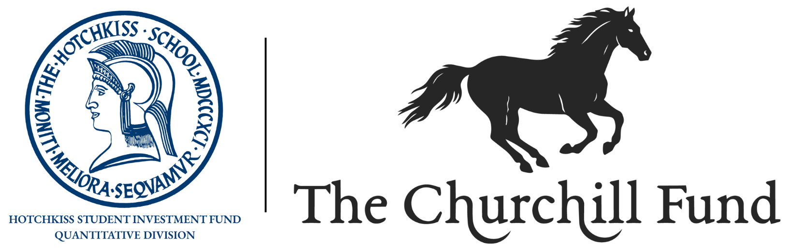

  

## Overview

Welcome to the official GitHub organization for the Quantitative Division of the **Hotchkiss Student Investment Fund**. 

We operate as the Hotchkiss chapter of **[The Churchill Fund](https://thechurchillfund.org/)**. This organization serves as the central hub for our quantitative research, algorithmic trading models, financial data pipelines, analytical tools, and more developed by our student analysts.

## Scope of Work

The repositories within this organization focus on the intersection of computer science, mathematics, and finance. Our primary efforts include:
* Developing data-driven strategies and predictive models
* Building reproducible tooling for portfolio analysis and risk management
* Conducting quantitative research to support the fund's broader investment mandates

## Open Source & Licensing

We believe in financial literacy and technical transparency. Unless otherwise specified, all public works and software repositories hosted within this organization are open-source and licensed under the **[MIT License](https://opensource.org/licenses/MIT)**. 

***

*For inquiries or alignment regarding chapter operations, please contact the fund administration or refer to the main repository maintainers.*
